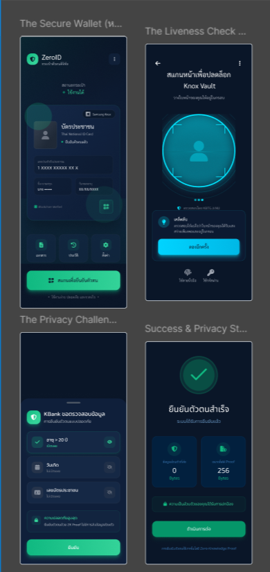

# ZeroID


> **"Prove who you are, without revealing who you are."**
> 
> The first Digital Identity Wallet in Thailand powered by **Samsung Knox Vault** and **Zero-Knowledge Proofs**.

---

## 🚨 The Problem: Data Breaches in Thailand
In 2023-2024 alone, over **75 million personal records** were leaked in Thailand, exceeding the total population. 

The root cause is the traditional KYC process: every verification requires copying and storing raw sensitive data on central servers. When a server is hacked, everything is lost.

**ZeroID** solves this by allowing users to prove eligibility (e.g., "Age > 20", "Thai Citizen") **without sharing any personal data**.

---

## 💡 Key Features

### 1. Hardware-Backed Security (Samsung Knox Vault) 🛡️
Unlike typical software wallets, ZeroID leverages **Samsung Knox Vault** to isolate digital identities from the main operating system.
- Private keys are generated and stored inside the secure hardware.
- Keys are non-extractable, even if the Android OS is compromised.
- Implemented using Android Keystore with StrongBox backing.

### 2. Privacy-First Verification (Zero-Knowledge Proofs) 🕵️
We utilize **Circom** and **snarkjs** to generate cryptographic proofs locally on the user's device.
- **Verifier sees:** `TRUE` or `FALSE` (Mathematical Proof).
- **Verifier DOES NOT see:** Name, ID Number, Address, or Birthdate.

### 3. Anti-Deepfake Liveness (Powered by AINU) 👤
To prevent identity theft and "account mules," every proof generation requires a biometric scan verified by **KBTG AINU** technology (Certified iBeta Level 2).

---

## 📱 User Interface (Prototype)



**[🎨 View Interactive Prototype on Figma]( https://www.figma.com/design/IFm2ofy2uRF3jIFrmAuTIQ/ZeroID?node-id=0-1&t=q6ps1kcGtdeqsIdp-1 )**

---

## 🏗️ System Architecture

Our architecture ensures that **no raw data is ever transmitted** during the verification process.

```mermaid
graph TD
    subgraph "Samsung Device (User)"
        UI["Mobile App (Kotlin/Compose)"]
        ZK["ZK Prover (snarkjs/WebView)"]
        Knox[("Samsung Knox Vault")]
        Face["AINU Liveness Check"]
    end

    subgraph "External World"
        Verifier["Verifier Node.js API"]
        Issuer["Mock Issuer"]
    end

    Issuer -->|"1. Issue Credential"| Knox
    Verifier -->|"2. Request Proof (QR)"| UI
    UI -->|"3. Liveness Check"| Face
    Face -->|"4. Unlock Key"| Knox
    Knox -->|"5. Sign Inputs"| ZK
    ZK -->|"6. Generate ZK Proof"| UI
    UI -->|"7. Send Proof Only"| Verifier
````

-----

## 🛠️ Tech Stack

This prototype is built using a hybrid approach to maximize security and compatibility:

| Component | Technology | Why? |
|-----------|------------|------|
| **Mobile App** | **Kotlin + Jetpack Compose** | Native performance & direct access to Android Hardware Security. |
| **Security** | **Android Keystore (StrongBox)** | Interface for Samsung Knox Vault hardware isolation. |
| **ZK Circuits** | **Circom + snarkjs** | Standard library for generating Zero-Knowledge Proofs. |
| **Backend** | **Node.js (Express)** | Scalable microservice for proof verification. |

-----

## 📂 Project Structure

We organize our codebase to separate concerns between hardware security, cryptography, and application logic.

```bash
ZeroID/
├── android/            # Native Android App (Kotlin + Compose)
│   ├── app/src/main/java/com/zeroid/
│   │   ├── keystore/   # Samsung Knox/Keystore Implementation
│   │   └── ui/         # Jetpack Compose Screens
├── circuits/           # ZK Circuits (Circom)
│   ├── age_check.circom
│   └── thai_citizen.circom
├── backend/            # Verifier API (Node.js)
└── docs/               # Architecture diagrams & Pitch deck
```

-----

## 🚀 Getting Started (Dev)

To run the prototype locally:

1.  **Prerequisites:**

      - Android Studio Koala+
      - Node.js v18+
      - Circom 2.0+

2.  **Setup Circuits:**

    ```bash
    cd circuits
    circom age_check.circom --r1cs --wasm --sym
    snarkjs groth16 setup ...
    ```

3.  **Run Verifier Node:**

    ```bash
    cd backend
    npm install && npm start
    ```

4.  **Build Android App:**

      - Open `android/` in Android Studio.
      - Sync Gradle and Run on a Samsung Device (Recommended for Knox features).

-----

## 🗺️ Roadmap for Hackathon

  - [x] **Phase 0:** Architecture Design & Feasibility Study
  - [x] **Phase 1:** UI/UX Design (Figma) & Circuit Logic
  - [ ] **Phase 2 (Hackathon):** Knox Integration & End-to-End Flow
  - [ ] **Phase 3:** Production-ready API for KBTG Ecosystem

-----

### Team

Created for **Samsung × KBTG Digital Fraud Cybersecurity Hackathon**

  * **[Pratan Nilson]** - Lead Architect & Cryptographer
  * **[Kunatip U-tong]** - Mobile Security Engineer
  * **[Nonthee Panatuek]** - Product Designer & AI Strategist

```
```
